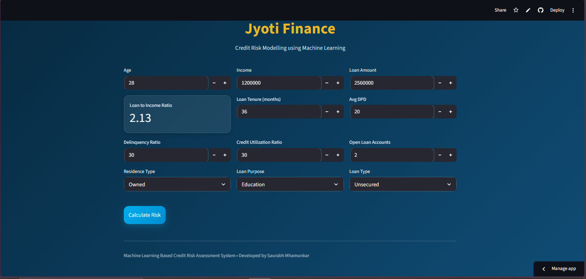
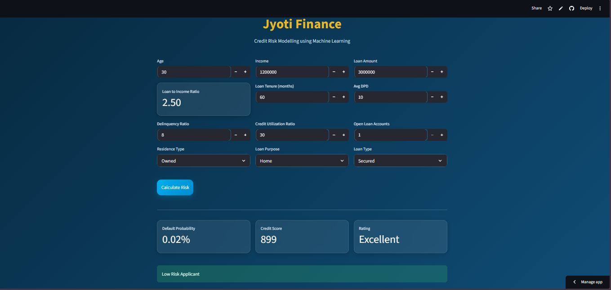

# 💳 Credit Risk Modelling using Machine Learning

A production-style Credit Risk Assessment System built using Machine Learning, Streamlit, and Scikit-learn that predicts loan default probability, generates credit scores, and classifies applicants into risk categories.

# 🌐 Live Demo

[](https://ml-project-credit-risk-assessment-system.streamlit.app/)

# 📸 Application Preview

## Home Dashboard



---

## Risk Prediction Results



The project simulates a real-world banking underwriting workflow including:
- Data preprocessing
- Feature engineering
- Model experimentation
- Class imbalance handling
- Hyperparameter tuning
- Credit score generation
- Risk evaluation metrics
- Streamlit deployment

---

# 🚀 Project Overview

Financial institutions use Credit Risk Models to evaluate whether an applicant is likely to default on a loan.

This project develops a complete end-to-end Credit Risk Modelling pipeline capable of:

✅ Predicting probability of default  
✅ Generating credit scores (300–900)  
✅ Risk rating classification  
✅ Handling imbalanced datasets  
✅ Performing feature engineering & model evaluation  
✅ Deploying through an interactive Streamlit application  

---

# 📊 Datasets Used

Three datasets were used:

| Dataset | Description |
|---|---|
| `customers.csv` | Customer demographic & financial information |
| `loans.csv` | Loan-related attributes |
| `bureau_data.csv` | Credit bureau behavioural data |

### Dataset Merging
- `customers.csv` and `loans.csv` merged using `cust_id`
- Final merged with `bureau_data.csv` using `cust_id`

---

# 🧠 Machine Learning Workflow

## 1. Train-Test Split
Train-test split performed **before EDA** to avoid data leakage and prevent the test set from influencing feature engineering decisions.

---

## 2. Data Cleaning
- Missing value handling
- Duplicate removal
- Outlier visualization using Boxplots
- Outlier treatment for Processing Fee column

---

## 3. Exploratory Data Analysis (EDA)

### Key Insights

### Age Analysis
- Average age of default group slightly lower than non-default group
- Younger applicants showed slightly higher default probability

### KDE Distribution Analysis
Strong predictors identified:
- Loan Tenure Months
- Delinquent Months
- Total DPD
- Credit Utilization Ratio

---

# ⚙️ Feature Engineering

### Engineered Features

## Loan-to-Income Ratio (LTI)
```python
loan_amount / income
```

### Insight
Higher LTI ratio strongly correlated with loan default risk.

---

## Delinquency Ratio
```python
delinquent_months * 100 / total_loan_months
```

### Insight
Higher delinquency ratio indicated elevated default probability.

---

## Avg DPD per Delinquency
```python
total_dpd / delinquent_months
```

### Insight
One of the strongest predictors for loan default.

---

# 📌 Feature Selection

### Techniques Used
- VIF (Variance Inflation Factor)
- Correlation Heatmap
- WOE (Weight of Evidence)
- IV (Information Value)

### Important Features
- Credit Utilization Ratio
- Loan-to-Income Ratio
- Delinquency Ratio

---

# 🤖 Models Trained

| Model | Description |
|---|---|
| Logistic Regression | Baseline interpretable model |
| Random Forest | Ensemble tree model |
| XGBoost | Gradient boosting model |

---

# ⚖️ Handling Class Imbalance

Multiple approaches were tested:

| Attempt | Technique |
|---|---|
| Attempt 1 | No imbalance handling |
| Attempt 2 | Random Undersampling |
| Attempt 3 | SMOTE-Tomek + Logistic Regression |
| Attempt 4 | SMOTE-Tomek + XGBoost |

---

# 🔍 Hyperparameter Tuning

## Logistic Regression
- RandomizedSearchCV
- Optuna Optimization

## XGBoost
- RandomizedSearchCV
- Optuna Optimization

---

# 📈 Final Model Performance

## 🔹 Best Logistic Regression Model

| Metric | Score |
|---|---|
| Accuracy | 93% |
| Precision (Default Class) | 0.57 |
| Recall (Default Class) | 0.94 |
| F1-Score | 0.71 |
| ROC-AUC Score | 0.98 |
| Gini Coefficient | 0.967 |

---

## 🔹 Best XGBoost Model

| Metric | Score |
|---|---|
| Accuracy | 96% |
| Precision (Default Class) | 0.72 |
| Recall (Default Class) | 0.86 |
| F1-Score | 0.78 |

---

# 📉 ROC-AUC Analysis

### ROC-AUC Score
```text
0.9836544617176851
```

### Interpretation
The model demonstrates exceptional ability to distinguish between:
- Default customers
- Non-default customers

---

# 📊 KS Statistic & Rank Ordering

### Maximum KS Statistic
```text
85.98
```

### Interpretation
The model exhibits excellent discriminatory power between good and bad customers.

---

# 📌 Gini Coefficient

### Gini Score
```text
0.9673089234353702
```

### Interpretation
Indicates extremely strong predictive capability and near-perfect rank ordering.

---

# 🏦 Credit Score Generation

The application converts default probability into a custom credit score ranging from:

| Score Range | Rating |
|---|---|
| 300 – 499 | Poor |
| 500 – 649 | Average |
| 650 – 749 | Good |
| 750 – 900 | Excellent |

---

# 🖥️ Streamlit Web Application

The project includes an interactive Streamlit UI with:
- Real-time prediction
- Credit score generation
- Default probability estimation
- Risk rating classification
- Banking-inspired UI design

---

# 📂 Project Structure

```bash
ML_Project_Credit_Risk_Model/
│
├── artifacts/
│   └── model_data.joblib
│
├── dataset/
│   ├── bureau_data.csv
│   ├── customers.csv
│   └── loans.csv
│
├── images/
│   ├── creditImage1.PNG
│   └── creditImageGreen.PNG
│
├── main.py
├── prediction_helper.py
├── requirements.txt
├── README.md
├── LICENSE
├── .gitignore
├── credit_risk_model_codebasics.ipynb
```

---

# 🛠️ Tech Stack

## Programming Language
- Python

## Libraries
- Pandas
- NumPy
- Scikit-learn
- XGBoost
- Optuna
- Imbalanced-learn
- Streamlit
- Matplotlib
- Seaborn
- Joblib

---

# ▶️ Running the Project

## 1. Clone Repository

```bash
git clone https://github.com/Saurabh136/ML_Project_Credit_Risk_Model.git
```

---

## 2. Navigate to Directory

```bash
cd ML_Project_Credit_Risk_Model
```

---

## 3. Install Dependencies

```bash
pip install -r requirements.txt
```

---

## 4. Run Streamlit App

```bash
streamlit run main.py
```

---

# 📌 Key Learnings

- End-to-end ML pipeline development
- Credit risk modelling techniques
- Handling imbalanced classification problems
- Hyperparameter optimization using Optuna
- Feature engineering for financial datasets
- Model evaluation using ROC-AUC, KS Statistic & Gini
- Deployment using Streamlit

---

# 🎯 Future Improvements

- SHAP Explainability
- LightGBM implementation
- Docker deployment
- Cloud deployment
- Real-time API integration
- Model monitoring dashboard
- CI/CD pipeline

---

# 👨‍💻 Author

## Saurabh Mhamunkar

Machine Learning | Data Science | AI Enthusiast

---

# ⭐ If you found this project useful, consider giving it a star.

